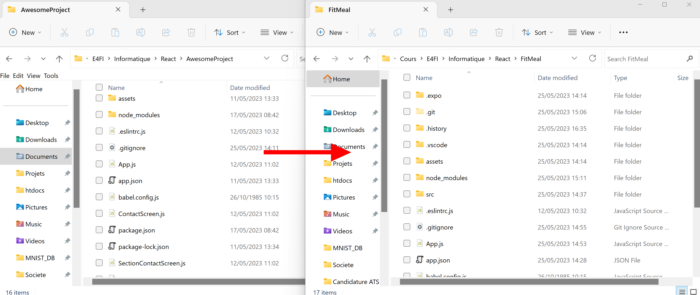
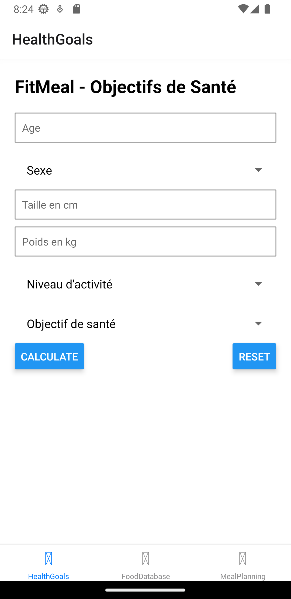
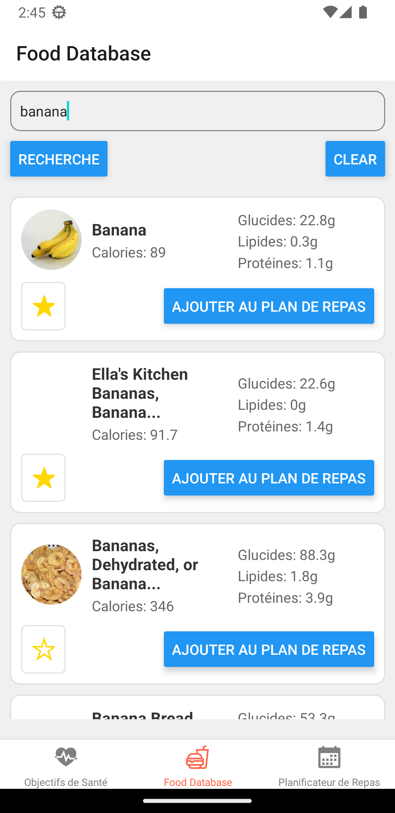
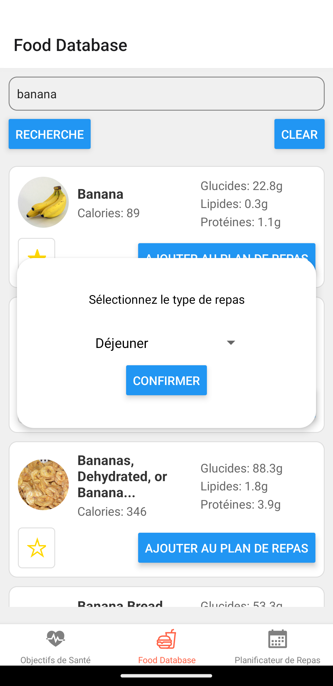

# FitMeal

## Table des matières
- [Introduction](#introduction)
- [Architecture de l'application](#architecture-de-lapplication)
- [Module 1 - Configuration du projet](#module-1---configuration-du-projet)
- [Module 2 - Objectifs de santé](#module-2---objectifs-de-santé)
- [Module 3 - Base de données alimentaires](#module-3---base-de-données-alimentaires)
- [Module 4 - Planification des repas](#module-4---planification-des-repas)
- [Fonctionnalités supplémentaires](#fonctionnalités-supplémentaires)
- [Roadmap](#roadmap)

## Introduction
Notre application **"FitMeal"**, développée par Julien Sarrau et Léo Mesbah, vise à faciliter la planification des repas en fonction des objectifs de santé de l'utilisateur. Cette application offre la possibilité de calculer l'apport calorique nécessaire et de rechercher des informations nutritionnelles pour une variété d'aliments.

## Architecture de l'application
"FitMeal" est construite sur React Native, permettant la création d'applications mobiles en JavaScript. Elle est divisée en quatre modules principaux :

1. Configuration du projet
2. Objectifs de santé
3. Base de données alimentaires
4. Planification des repas

## Module 1 - Configuration du projet
Le premier module a été consacré à la mise en place de notre environnement de développement et à la création de notre dépôt GitHub. Nous avons réutilisé l'installation effectuée lors des TDs en clonant le projet et en modifiant seulement les noms.

## Module 2 - Objectifs de santé
Le deuxième module permet aux utilisateurs de saisir leurs informations personnelles et de calculer leur apport calorique recommandé en fonction de leurs objectifs de santé.

Au cours du développement de ce module, nous n'avons pas rencontré trop dé complications étant donné que les formules étaient déjà données dans les instructions.

Nous avons eu un peu plus de difficultés sur la gestion des différents types d'input et leur validation. Nous avons dû mettre en place des vérifications pour s'assurer que les entrées de l'utilisateur étaient bien dans les plages acceptables, pour éviter par exemple que l'utilisateur envoi le formulaire sans avoir choisi le sexe, le niveau d'activités etc.. 

Nous avons des legers problème car nous souhaitions ajouter un bouton reset pour réinitialiser le formulaire, mais la gestion des erreurs après l'appel au bouton reset était un peu compliqué. Nous avons finalement réussi à résoudre le problème en faisant une fonction de remise à défaut du formulaire et en vérifiant dans notre fonction calculateCaloricIntake si toutes les entrées étaient bien remplies auquel cas on affiche un message d'erreur.

## Module 3 - Base de données alimentaires
Tout d'abord, nous avons choisi d'utiliser l'API **Edamam**, qui fournit des informations détaillées sur différents aliments, y compris leur teneur en calories et d'autres faits nutritionnels, facilement récupérable et avec de nombreuses données. Après nous être inscrits pour obtenir une clé API, nous avons passé du temps à nous familiariser avec la documentation de l'API pour comprendre comment faire des requêtes.

Ensuite, nous avons commencer à développer le screen FoodDatabase, qui intégrera une recherche dans notre application pour trouver les aliments à ajouter à notre MealPlanning. Cette interface comprend une barre de recherche avec le nom d'un aliment à trouver, et affiche une liste de résultats des aliments correspondants en faisant appel à l'API. L'intégration avec l'API Edamam s'est faite sans trop de problèmes étant donné que nous travaillons régulièrement avec des APIs à titre personnels, d'autant plus que l'API permet de simplement avoir ces données avec une requête GET ayant en paramètre l'APP id et l'API key, ce qui est vraiment pratique.

Nous avons aussi ajouté quelques fonctionnalités supplémentaires à ce module. D'abord, nous avons créé un bouton "favori" pour chaque aliment dans les résultats de la recherche, car nous considérons que cela sera beaucoup plus facile pour un utilisateur de retrouver ses aliments fréquents dans une liste de favori pour l'ajout des repas plutôt que d'effectuer une requête à chaque fois. Les utilisateurs peuvent cliquer sur ce bouton pour ajouter un aliment à leur liste de favoris, et nous implémenterons une zone de favori au moment de l'ajout à la date. Nous ne sommes pas encorr certain de comment nous allons procéder pour l'instant. Cela nous a posé quelques défiscar nosu avons dû commencer à entreprendre de la persistance de données (notamment avec AsyncStorage) pour stocker la liste des favoris.

Voici à quoi ressemble notre page de recherche à ce stade-ci du développement de notre application :

De plus, nous avons utilisé modal de choix de repas lors du clic sur le bouton "Ajouter au plan de repas". Cette modal permettra aux utilisateurs de sélectionner à quel repas de la journée ils souhaitent ajouter l'aliment choisi. 

Nous avons eu des difficultés pour gérer correctement l'état du type de repas sélectionné et l'ajout de l'aliment dans le bon repas du plan, mais nous avons réussi à résoudre ces problèmes après plusieurs essais. Cependant, nous rencontrons une erreur lors de l'ajout à ce stade de l'application que nous avons du mal à résoudre lors de l'ajout de l'application car expo n'affiche pas la ligne de l'erreur. L'erreur étant "**TypeError: Cannot convert undefined value to object"**. Au final, on a remarqué que expo avait cessé de "mettre à jour" notre Android virtuel , c'est à dire qu'on a voulu par exemple modifier le formulaire, et cela ne se mettait pas à jour, il y avait donc un problème. Après un reload de l'app, de expo, un cold boot de la vm etc, ça ne fonctionnait toujours pas. C'est le lendemain en ressayant (donc en redémarrant le PC) que le problème avait été réglé.

Nous ne savons pas encore à  ce niveau-là comment nous allons organiser la dernière page vis-à-vis de l'ajout de la nourriture (vue journalière, de la semaine..?).

Malgré quelques défis techniques, ce module a été une occasion d'apprendre et de pratiquer l'intégration avec une API externe en React, la gestion de l'état et la manipulation des données.

## Module 4 - Planification des repas

Lors de la planification des repas deux défis majeures se sont posés : 
- Stocker les données des repas de sorte à ce qu'elles soient communes aux différentes View
- Stocker dans un cache les données déjà ajoutés par l'utilisateur

Dans le premier cas, nous souhaitons faire en sorte que dans la vue du module 3, on puisse ajouter des repas qui serotn affichés dans le Module 4. Cela signifie que le contenu des repas devra être ajouté dans une variable partagé entre les différentes vues. Pour cela, suivant la documentation, nous avons utilisé le système de Context de React afin de définir dans le parent commun aux vues (App.js) la définition des variables de notre contexte. Ensuite il suffit d'importer les variables correspondantes dans nos différentes vues en utilisant useContext. La partie la plsu compliquée résidée dans le fait de stocker un `<MealPlanContext.Provider value={{ cMealPlan, setMealPlan }}>` dans l'App.js car nous avions des undefined lorsque l'on souhaité acéder à cMealPlan depuis les autres vues utilisant le contexte.

Une fois réglé, nous sommes passés à la sauvegarde des informations du MealPlan dans l'AsyncStorage comme cela a été fait pour l'ajout des favoris. Cela était relativement plus facile que l'utilisation des contextes. Il a fallu tout de même récupérer les informations au démarrage de l'AsyncStorage (des favoris et des mealplan) afind e correctement afficher les données dans la vue du module 4.

## Fonctionnalités supplémentaires

Nous avons également ajouté quelques fonctionnalités supplémentaires à notre application FitMeal pour améliorer le projet.

Tout d'abord, nous avons créé une page d'accueil qui présente les fonctionnalités de l'application et invite les utilisateurs à commencer leur parcours de planification des repas. Cette page d'accueil offre une première impression autre que directement le formulaire.

Nous avons développé également un système de favoris pour permettre aux utilisateurs de sauvegarder leurs aliments préférés. Lorsqu'un utilisateur recherche un aliment à travers l'API, il peut cliquer sur l'icone favori pour l'ajouter à sa liste de favoris. Cela permet un accès rapide et facile aux aliments fréquemment consommés lors de la planification des repas.

## Roadmap
- **25 Mai** : Développement du Module 1 - Installation du projet. Rédaction du README. Rédaction de la documentation.
- **26 Mai - 31 Mai 2023** : Développement du Module 2 - Objectifs de santé.
- **1er Juin  - 10 Juin 2023** : Développement du Module 3 - Base de données alimentaires.
- **11 Juin - 20 Juin 2023** : Développement du Module 4 - Planification des repas et d'une page d'accueil. Production de la vidéo finale.
- **21 Juin 2023** : Date de soumission du projet.

Julien et Léo